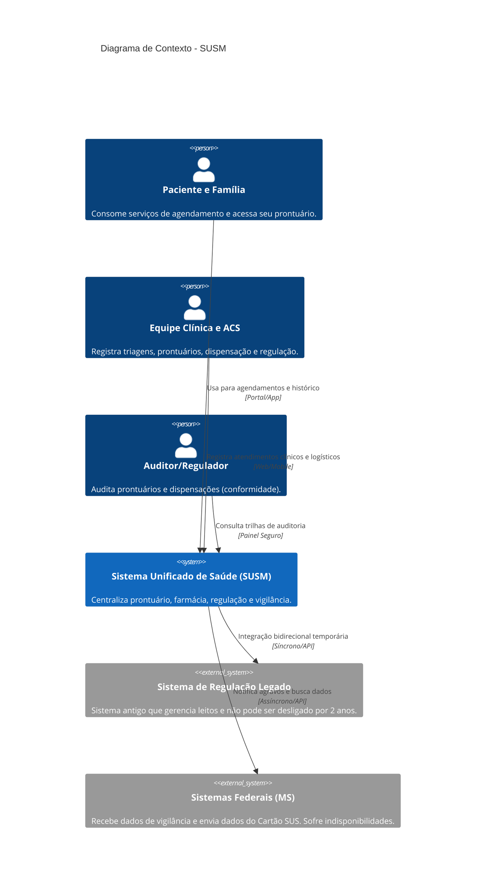
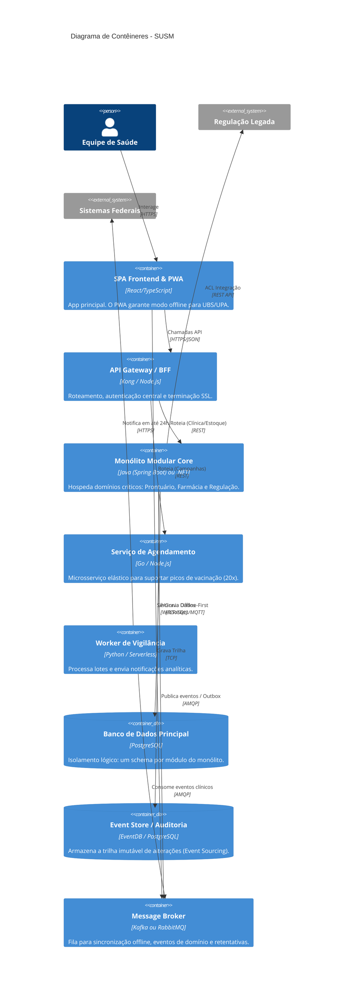
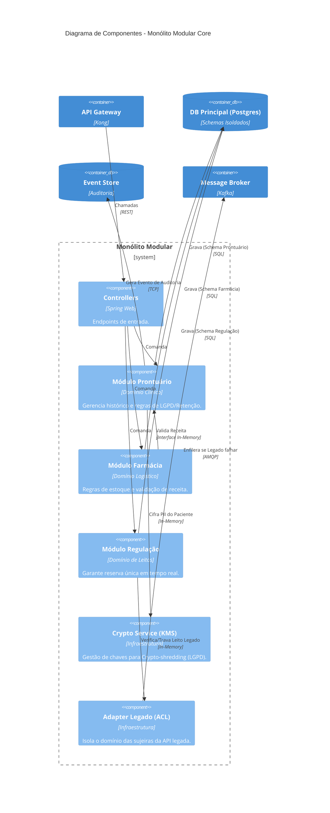

# Documento de Arquitetura: Sistema Unificado de Saúde Municipal (SUSM)
**Grupo 10 | Tema 2 (Saúde) | Envelope E**

## 1. Diagramas C4

### Nível 1: Contexto
O diagrama de contexto foca nas interações dos usuários do sistema de saúde (pacientes, equipe clínica, gestores) com o novo sistema unificado e as integrações externas obrigatórias (Sistemas Federais e o Legado de Regulação).

### Nível 2: Contêineres
O sistema utiliza uma estrutura principal baseada em um **Monólito Modular** para preservar consistência nos domínios transacionais cruzados (Prontuário, Farmácia, Regulação Interna), extraindo apenas o necessário para microsserviços (Agendamento) devido a picos sazonais extremos.

### Nível 3: Componentes (Foco no Monólito Modular Core)
Detalhe interno do Monólito Modular mostrando como as fronteiras dos módulos são respeitadas, comunicando-se por interfaces in-memory, mas persistindo em schemas separados. 

---

## 2. Mapa de Restrições e Decisões

| Restrição / Requisito do Envelope e Caso | Decisão Arquitetural Adotada | ADR Relacionado |
| :--- | :--- | :--- |
| **Equipe e Orçamento:** 15 devs, 1 conformidade, nuvem pública paga. | Uso de **Monólito Modular** para o core. Evita a sobrecarga de operações distribuídas de microsserviços, cabendo no time de 15, usando nuvem. | ADR 01, ADR 04 |
| **Auditoria Sanitária Rigorosa:** Tudo precisa ser reconstruível. | Adoção parcial de **Event Sourcing** para manter uma trilha de auditoria imutável (quem alterou, quando e o quê). | ADR 02, ADR 05 |
| **Conflito Legal:** Guarda de 20 anos *vs* Direito ao esquecimento (LGPD). | Uso do padrão **Crypto-shredding** nos dados PII dentro do Event Store e Bancos de Dados. | ADR 05 |
| **Rede/Infra:** Internet instável nas UBS e UPAs (cai diariamente). | Estratégia **Offline-First no Frontend** com banco local (IndexedDB) e sincronização assíncrona baseada em eventos (Broker). | ADR 01, ADR 03 |
| **Regulação:** Leito reservado só uma vez; disputa em tempo real. | Transações locais (ACID) no banco de dados e comunicação síncrona dentro do módulo de regulação. | ADR 02 |
| **Agendamento:** Pico de campanhas (vacina) até 20x o acesso normal. | Extração exclusiva desse domínio para um **Microsserviço de Agendamento** autônomo e elástico. | ADR 01, ADR 04 |
| **Integração:** Legado ativo por 2 anos (API antiga) / MS indisponível. | Estilo **Hexagonal (Ports and Adapters)** criando Camada Anticorrupção (ACL) e retentativas em fila (Broker). | ADR 03 |

---

## 3. Registros de Decisão Arquitetural (ADRs)

### ADR 01: Estrutura Geral Híbrida (Monólito Modular com Satélites)
* **Status:** Aceito
* **Contexto:** Temos uma equipe enxuta (15 devs) e domínios fortemente acoplados pelas regras de negócio (farmácia exige checar prontuário; regulação exige travar leito). Contudo, há um domínio (agendamento) com picos de tráfego de 20x que não pode derrubar o atendimento clínico.
* **Decisão:** Adotar uma arquitetura híbrida. O núcleo (Prontuário, Farmácia, Regulação Interna) será construído em um **Monólito Modular** para facilitar a governança, manter transações ACID onde necessário e reduzir custos operacionais na nuvem. O módulo de *Agendamento de Campanhas* e a *Integração com Vigilância Epidemiológica* serão isolados como **Microsserviços/Workers**.
* **Alternativas Descartadas:** 
  * *Microsserviços Puros:* Descartado. Com 15 devs, rastreabilidade distribuída, consistência eventual e gerência de infraestrutura em 6-10 serviços consumiria a equipe, prejudicando a entrega.
* **Consequências:**
  * **Positivas:** Simplicidade no deploy inicial do core; escalabilidade independente apenas onde a dor existe (agendamento); isolamento das regras clínicas (modificabilidade).
  * **Negativas:** Deploy e escalabilidade do core continuam atrelados. Se o módulo de farmácia demandar mais CPU, o monólito inteiro escala.

### ADR 02: Gestão de Dados e Consistência (Database-per-Module e ACID)
* **Status:** Aceito
* **Contexto:** A regulação de leitos não permite dupla reserva em hipótese alguma (requer consistência forte). Simultaneamente, não podemos ter uma "bola de lama" no banco de dados, o que impediria extrair módulos no futuro.
* **Decisão:** Utilizaremos um único cluster PostgreSQL, mas com **isolamento por schemas lógicos** (um schema por módulo: `schema_prontuario`, `schema_farmacia`). Não haverá *JOINs* diretos entre schemas. A comunicação entre módulos será feita por in-memory method calls (para leitura imediata) e Domain Events no Message Broker (para consistência eventual em outros sistemas).
* **Alternativas Descartadas:**
  * *Bancos de Dados Fisicamente Separados:* Muito caro para o estágio atual (aumenta o custo na nuvem pública).
  * *Banco de Dados Único Partilhado:* Violaria o princípio do Monólito Modular (Caps. 5 e 6).
* **Consequências:**
  * **Positivas:** Preserva transações locais e fortes invariantes no domínio de regulação; mantém o sistema preparado para microsserviços no futuro.
  * **Negativas:** Exige disciplina da equipe; chamadas entre domínios devem ser mapeadas em código, o que gera um overhead se comparado a uma query unificada.

### ADR 03: Integração com Legado e Federais via Camada Anticorrupção
* **Status:** Aceito
* **Contexto:** O sistema de regulação antigo não pode ser desligado por dois anos e tem uma API ruim. Sistemas federais têm quedas frequentes de indisponibilidade. As UBSs caem offline.
* **Decisão:** Aplicaremos o padrão de **Ports and Adapters (Hexagonal)** nas bordas de integração. Criaremos uma *Anti-Corruption Layer (ACL)* para isolar o Monólito do legado. Para comunicações externas (Governo e sincronia UPA/UBS offline), utilizaremos filas (Broker) garantindo enfileiramento e re-tentativa quando os sistemas parceiros ou a rede retornarem.
* **Alternativas Descartadas:**
  * *Enterprise Service Bus (ESB):* Descartado por ser caro, complexo e demandar especialistas não disponíveis no time de 15 pessoas.
* **Consequências:**
  * **Positivas:** O domínio clínico fica imune a falhas de rede externas e a modelos de dados sujos do sistema antigo.
  * **Negativas:** Aumenta a quantidade de classes e mapeadores (Mappers/DTOs) no código.

### ADR 04: Implantação, Escala e Operação na Nuvem Pública
* **Status:** Aceito
* **Contexto:** Temos orçamento em nuvem paga por uso e um requisito legal para manter a trilha de auditoria segura (Envelope E).
* **Decisão:** Toda a infraestrutura será conteinerizada (Docker) e orquestrada via serviços gerenciados de nuvem (ex: AWS ECS ou EKS, RDS, MSK/RabbitMQ). Utilizaremos logs centralizados e estruturados associados a um `correlation_id` e Tracing Distribuído.
* **Alternativas Descartadas:**
  * *Serverless total (Cap 12):* Rejeitado para o núcleo porque o tempo de partida (cold start) e as limitações de estado prejudicam a consistência e o fluxo contínuo exigidos pelo tempo real da regulação e auditoria síncrona.
* **Consequências:**
  * **Positivas:** Facilidade de escalar o microsserviço de agendamento 20x sem impactar o monólito. Alta observabilidade exigida pela auditoria sanitária.
  * **Negativas:** Custo fixo atrelado aos serviços gerenciados e necessidade de dominar o pipeline CI/CD.

### ADR 05: Resolução de Conflito Legal (Trilha Imutável vs LGPD) - A Mais Arriscada
* **Status:** Aceito
* **Contexto:** A auditoria sanitária exige que saibamos quem alterou o quê para sempre (retenção clínica de 20 anos). A LGPD (lei de proteção de dados) garante ao paciente o direito ao esquecimento e eliminação de dados, o que entra em conflito com o Event Sourcing (eventos imutáveis não podem ser apagados ou alterados).
* **Decisão:** Adotar **Crypto-shredding (Destruição Criptográfica)**. O conteúdo clínico na trilha de auditoria manterá seu formato imutável, mas os *Dados Pessoais Identificáveis (PII)* do paciente dentro do Event Store serão criptografados usando uma chave única de criptografia por paciente. 
* **Alternativas Descartadas:**
  * *Apagar os eventos do Event Store:* Quebra o princípio da imutabilidade da auditoria sanitária e corrompe o estado do sistema.
  * *Deixar os dados expostos:* Multas pesadas por infração à LGPD.
* **Consequências:**
  * **Positivas:** Atendemos 100% a auditoria sanitária (não adulteramos registros) e 100% a LGPD. Ao receber ordem de exclusão, apenas apagamos a *chave de criptografia* do paciente no Key Management Service (KMS). O dado imutável nos logs torna-se ruído aleatório impossível de reverter, garantindo o esquecimento.
  * **Negativas:** Adiciona overhead de processamento para encriptar/desencriptar dados PII a cada leitura/escrita e torna o Gerenciador de Chaves (KMS) um ponto crítico de falha e backup.

---

## 4. Respostas às Perguntas Obrigatórias do Caso

**1. (A Pergunta do Envelope E): Como vocês guardam tudo para sempre e ainda assim apagam o que a lei manda apagar?**
**Resposta:** Através do padrão de **Crypto-shredding**, sustentado pelo **ADR 05**. Todo dado que trafega e é persistido no nosso banco e na nossa trilha de auditoria (*Event Store*) que contenha PII (dados sensíveis do paciente) é cifrado com uma chave única correspondente àquele paciente. O sistema arquiva a trilha das decisões (quando o remédio foi dispensado, por qual médico) intacta por 20 anos, agradando o órgão sanitário. Quando a LGPD exige a deleção dos dados, nós destruímos permanentemente a chave criptográfica desse paciente no serviço de chaves (KMS). Os registros históricos permanecem no banco, garantindo integridade estrutural, mas o conteúdo pessoal vira um dado criptografado irrecuperável, efetivando o "esquecimento legal". (*Ver Diagrama de Componentes: Componente Crypto Service*).

**2. Como o sistema lida com a internet instável nas UBSs e picos nas UPAs sem perder nem duplicar dados?**
**Resposta:** Baseado no **ADR 01** e **ADR 03**, utilizamos uma interface SPA instalada como PWA (Progressive Web App), com modo Offline-First. Os dados de triagem da UPA são persistidos em cache local (IndexedDB). Quando a conexão volta, o Front-end despacha o pacote de dados para o API Gateway que, por sua vez, insere esses eventos no Message Broker (Kafka/RabbitMQ). O Monólito processa a fila de forma assíncrona, utilizando IDs únicos para cada atendimento (idempotência). Isso garante que o trabalho na UPA não pare pela falta de internet e nenhum dado seja gravado em duplicidade na volta.

**3. Como garantir que dois pacientes não reservem o mesmo leito, e como integrar isso ao legado?**
**Resposta:** Sustentado pelo **ADR 02** e o **ADR 03**. A reserva de leito exige consistência rigorosa (forte). Dentro do Monólito Modular, o módulo de Regulação utiliza transações relacionais ACID no seu respectivo schema do PostgreSQL para aplicar travas em nível de banco de dados (`SELECT FOR UPDATE`). Como existe um sistema legado ativo, o módulo invoca a *Anti-Corruption Layer (ACL)* que, de forma síncrona, verifica a disponibilidade externa e traduz os contratos. Se falhar no meio, a transação local faz *rollback* imediato, impedindo que exista um leito fantasma nas bases.

**4. Como o sistema escala perante campanhas de vacinação (pico de 20x) sem derrubar prontuário e regulação?**
**Resposta:** Suportado pelos **ADRs 01 e 04**. Em vez de escalar toda a infraestrutura complexa do Monólito clínico, extraímos unicamente a jornada do paciente para um **Microsserviço de Agendamento**. Ele reside em um cluster separado na nuvem, configurado para escalar horizontalmente de forma autônoma sob uso de CPU/Requisições. Quando a vacinação é agendada, esse serviço emite um evento (Event-Driven) para o Broker. O Monólito Core consome este evento no seu próprio ritmo sem ser sobrecarregado, garantindo alta disponibilidade nos atendimentos de emergência e UPA.

**5. Como reconstruir a trilha de acesso para a auditoria sanitária sem gargalar a operação?**
**Resposta:** Sustentado pelo **ADR 05** e **ADR 01**. Utilizamos interceptores nas bordas dos módulos do Monólito (Controllers). Qualquer comando de modificação no prontuário ou na farmácia (ex: dispensação de lote) além de alterar o estado atual no schema relacional daquele módulo (CQRS simplificado), emite um evento de domínio (`RemedioDispensadoEvent`). Esse evento é salvo assincronamente em um *Event Store* de "append-only". A auditoria consulta exclusivamente essa base secundária, protegendo o desempenho operacional do banco clínico principal.